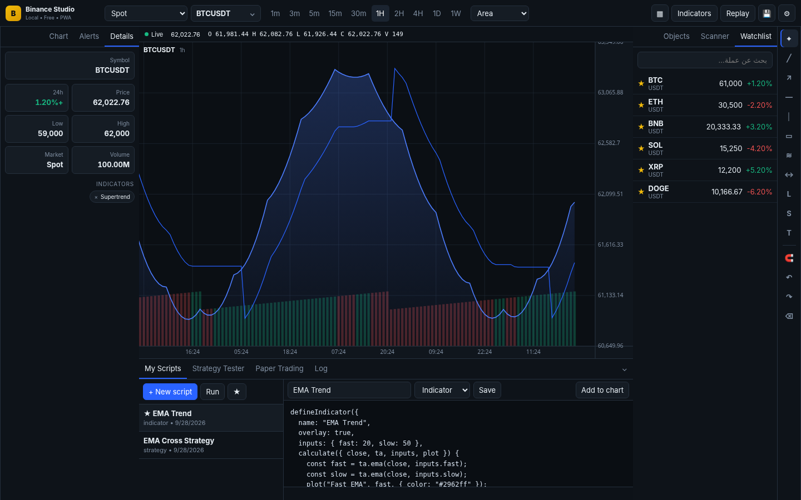
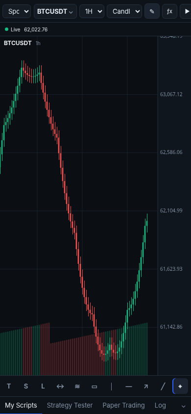

# Binance Chart Studio





منصة تحليل محلية ومجانية لـ Binance، مبنية لتكون Workspace رئيسية على اللابتوب والجوال بدون اشتراك TradingView وبدون API مدفوعة.

## ما الموجود داخل المشروع

- Binance Spot و USDⓈ-M Futures.
- جلب قائمة الأسواق تلقائيًا من `exchangeInfo` وإعادة فحص الإدراجات الجديدة أثناء تشغيل المنصة.
- بيانات شموع تاريخية + WebSocket حي لكل شارت.
- Multi-chart: شارت واحد، 2، 4 أو 6 شارتات، مع فريم مستقل داخل رأس كل شارت وإمكانية مزامنة الرمز والفريم والـCrosshair عند الرغبة.
- أنواع شارت: Candles, Bars, Line, Area, Heikin Ashi.
- Zoom / pan / crosshair / volume / autoscale، مع سحب مباشر لمحور الزمن ومحور السعر مثل TradingView.
- Price scale: Linear / Logarithmic / Percentage / Indexed to 100.
- أدوات رسم: Trend, Ray, Extended Line, Horizontal/Vertical, Horizontal Ray, Rectangle, Parallel Channel, Fibonacci Retracement, Trend-Based Fib Extension, Fib Channel, Pitchfork, Schiff, Modified Schiff, Measure, Long/Short R:R, Text، Magnet، Undo/Redo.
- Long/Short Position محسّنة داخل نفس الأداة: Entry / Stop / Target / Width handles ونسب 1R / 1.5R / 2R / 3R.
- مؤشرات جاهزة مع إعدادات قابلة للتعديل: EMA, SMA, WMA, DEMA, TEMA, Bollinger Bands, VWAP, Donchian, Keltner, Supertrend, Ichimoku, Parabolic SAR, RSI, MACD, ATR, Stochastic, ADX, CCI, MFI, Williams %R, ROC, Momentum, OBV, CMO.
- My Scripts: محرر JavaScript، حفظ، مفضلة، تشغيل داخل Web Worker مع timeout، وإضافة المؤشر للشارت.
- Strategy scripts + Strategy Tester مع fees/slippage/position sizing وTrades وEquity Curve وWin rate/Profit factor/Drawdown.
- Bar Replay متزامن زمنيًا بين الفريمات المفتوحة، مع مصدر Replay ثابت والبحث في كامل التاريخ المخفي بدون كشف المستقبل.
- Scanner للعملات USDT من بيانات Binance 24h.
- Watchlist قابلة للإضافة/الحذف + Object Tree احترافي (إخفاء/قفل/حذف) + Alerts محلية + Paper Trading.
- قائمة مؤشرات فوق كل شارت مثل TradingView: إظهار/إخفاء، إعدادات، حذف، وطي القائمة بالكامل.
- القوائم اليسرى واليمنى والسفلية قابلة لتغيير الحجم بالسحب مع حفظ المقاسات.
- حفظ Workspaces والرسومات والسكربتات والصفقات محليًا في IndexedDB.
- Export / Import نسخة احتياطية JSON.
- PWA + Service Worker + تصميم Desktop/Mobile + Touch drawing toolbar.
- لا توجد أي حزم npm أو مكتبات خارجية مطلوبة للتشغيل المحلي العادي. بناء iOS عبر GitHub يثبت Capacitor مؤقتًا داخل بيئة البناء فقط.

## التشغيل على اللابتوب

### الأسهل
Windows: شغّل `start.bat`.

macOS/Linux:

```bash
./start.sh
```

ثم افتح:

```text
http://localhost:8787
```

إذا كان Node.js موجودًا يمكنك أيضًا تشغيل:

```bash
npm start
```

ولا يوجد `npm install` لأن المشروع لا يعتمد على أي package خارجية.

## الآيفون وملف IPA

ابتداءً من v1.5 يمكن بناء التطبيق كـ **IPA مستقل** عبر GitHub Actions، بدون Xcode على جهازك وبدون اعتماد على `localhost`. ملفات BCS تُضمّن داخل تطبيق iPhone نفسه، ثم يتصل التطبيق مباشرةً بـBinance عبر الإنترنت.

الـWorkflow الموجود في `.github/workflows/build-ios-ipa.yml` يبني IPA غير موقّع باستخدام Capacitor 8 وSwift Package Manager على GitHub، وبعدها يمكن توقيعه بالطريقة التي تستخدمها أنت.

الدليل الكامل خطوة بخطوة موجود هنا:

```text
docs/IOS_GITHUB_BUILD_AR.md
```

وللاستخدام السريع من Safari فقط، ما زال بإمكانك فتح عنوان IP للكمبيوتر مع المنفذ `8787` عندما يكون الجهازان على نفس الشبكة.

## My Scripts API

### Indicator

```javascript
defineIndicator({
  name: "EMA Trend",
  overlay: true,
  inputs: { fast: 20, slow: 50 },
  calculate({ close, ta, inputs, plot }) {
    const fast = ta.ema(close, inputs.fast);
    const slow = ta.ema(close, inputs.slow);
    plot("Fast EMA", fast, { color: "#2962ff" });
    plot("Slow EMA", slow, { color: "#f0b90b" });
  }
});
```

### Strategy

```javascript
defineStrategy({
  name: "EMA Cross",
  inputs: { fast: 20, slow: 50, stopPct: 1.5, takePct: 3 },
  run({ close, ta, inputs, strategy }) {
    const fast = ta.ema(close, inputs.fast);
    const slow = ta.ema(close, inputs.slow);
    for (let i = 1; i < close.length - 1; i++) {
      if (ta.crossover(fast, slow, i))
        strategy.entry(i, "long", { stopPct: inputs.stopPct, takePct: inputs.takePct });
      if (ta.crossunder(fast, slow, i)) strategy.close(i);
    }
  }
});
```

الدوال المتاحة للسكربت حاليًا تشمل `sma`, `ema`, `rsi`, `atr`, `std`, `crossover`, `crossunder`, `highest`, `lowest`.

## تنبيه مهم عن Zero-cost

لأن التصميم Local-first ولا يوجد Backend دائم، تنبيهات الأسعار تعمل أثناء فتح المنصة/PWA. تشغيل تنبيه في الخلفية بينما كل أجهزتك مغلقة يتطلب عملية تعمل 24/7 في مكان ما. لم أضع خدمة مدفوعة أو مفتاحًا سريًا داخل المشروع.

## الاختبارات

```bash
npm test
```

الاختبار الآلي الحالي يغطي 49 مؤشرًا جاهزًا، Backtest، Replay، Heikin Ashi، وحسابات Long/Short Position. كما يتم فحص Syntax لكل ملفات JavaScript قبل الحزم.

## الإصدار 1.1 — تحسينات التحكم (TradingView-style)

- **زوم وتحكم:** عجلة الماوس للتكبير حول المؤشر، Shift+عجلة أو الأسهم للتحريك، سحب محور السعر (يمين) لتكبير/تصغير السعر، دبل كليك على المحور أو على الشارت لإعادة الضبط، Pinch بإصبعين على الجوال، وأزرار − / + / ملاءمة / آخر شمعة أسفل الشارت.
- **تحميل تاريخ أقدم تلقائيًا** عند التحريك أو التصغير نحو اليسار.
- **إخفاء وإظهار القوائم:** أزرار في الشريط العلوي (Alt+1 … Alt+4) + مقابض على الحافة لإعادتها، ووضع تركيز `Shift+F` لشارت أكبر، وزر ملء الشاشة، وتكبير أي شارت داخل تخطيط متعدد.
- **فريمات إضافية:** 1m 3m 5m 15m 30m 1H 2H 4H 6H 8H 12H 1D 3D 1W 1M من القائمة ▾.
- **إصلاحات:** نوع Bars كان يتعطل، Heikin Ashi كان يرسم شموعًا عادية، الرسومات كانت تنحرف بعد إعادة التحميل، اللوحة السفلية المطوية تترك فراغًا، الكاش القديم للـ Service Worker، مسار الخادم.
- **رسم:** الأداة ترجع للمؤشر بعد كل رسمة، سحب الرسم كاملًا، و`Esc` للإلغاء، وخط/وسم آخر سعر على المحور.


## الإصدار 1.2 — تطوير النسخة المحسنة بدون كسر تحسينات المستخدم

- الحفاظ على تحميل التاريخ القديم وPinch/Zoom والتحكمات التي كانت موجودة في النسخة المحسنة.
- إصلاح Replay بحيث ينتقل فعليًا للشموع التالية ويزامن الشارتات المختلفة حسب الزمن مع بقاء المستقبل مخفيًا.
- محدد فريم مستقل داخل كل شارت في Multi-chart.
- قائمة مؤشرات ظاهرة أعلى الشارت مع Hide / Settings / Remove وزر طي للقائمة.
- إعدادات المؤشر تعمل على الشارت الذي فُتحت منه النافذة، مع Reset Defaults.
- Object Tree يدير المؤشرات والسكربتات والرسومات مباشرة.
- سحب محور الزمن لتوسيع/ضغط الشموع، وسحب محور السعر لتوسيع/ضغط المقياس، ودبل كليك لإعادة الضبط.
- Linear / Logarithmic / Percentage / Indexed-to-100 price scale.
- Resizable panels مع حفظ الحجم.
- حذف/إخفاء/قفل/نسخ الرسومات من نفس Drawing Manager الحالي.
- تطوير Long/Short Position الحالية بدل إنشاء أداة مكررة.
- إضافة القنوات وFib المتقدم وPitchfork/Schiff/Modified Schiff داخل نفس نظام الرسومات.
- Service Worker cache version جديدة حتى لا يبقى المتصفح على كود قديم بعد التحديث.

## BCS Pro Indicators

المؤشرات الاحترافية المضافة تحمل بادئة موحدة **BCS Pro**. اكتب `BCS` في بحث المؤشرات لعرض الحزمة كاملة، أو ابحث بكلمة الوظيفة مثل `Liquidity` أو `Trend` أو `FVG` أو `Momentum`.


## الإصدار 1.4 — BCS Pro Research Pack

أضيفت حزمة جديدة من المؤشرات الاحترافية بتطبيق مستقل داخل محركنا، مستوحاة من **الوظائف العامة المعلنة** لأدوات مدفوعة من ناشرين مختلفين غير LuxAlgo. لا يحتوي المشروع على كود منسوخ أو مفكوك الحماية من أي مؤشر مغلق المصدر.

المؤشرات الجديدة:

- `BCS Pro — Harmonic PRZ Scanner`
- `BCS Pro — Pattern Breakout Radar`
- `BCS Pro — Institutional Imbalance Pressure`
- `BCS Pro — Order Block Mitigation Map`
- `BCS Pro — Compression / Expansion Regime`
- `BCS Pro — Momentum Structure Bias`
- `BCS Pro — Projected ATR Volatility Levels`
- `BCS Pro — Demand / Supply Zone Engine`
- `BCS Pro — Weighted Curve Channel`
- `BCS Pro — Rolling Volume Profile Map`

اكتب `BCS` في بحث المؤشرات لعرض الحزمة كاملة. تفاصيل المنهج والمراجع الوظيفية موجودة في `docs/PRO_INDICATORS.md`.


## الإصدار 1.5 — iOS / GitHub IPA

- بناء IPA غير موقّع مباشرةً من GitHub Actions.
- Capacitor 8 + Swift Package Manager.
- لا يحتاج iPhone إلى الكمبيوتر أو `localhost` بعد تثبيت التطبيق.
- دعم Safe Area للنوتش وHome Indicator.
- Export Workspace وصورة الشارت تستخدم Share Sheet على iOS عند توفرها.
- ملفات الشهادات والتوقيع غير موجودة داخل المشروع؛ التوقيع النهائي يتم خارج GitHub.
